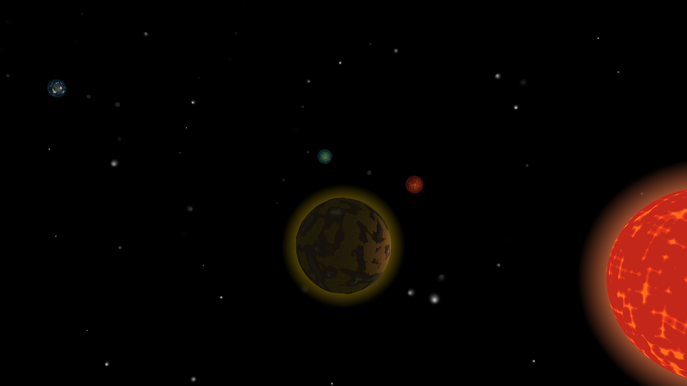
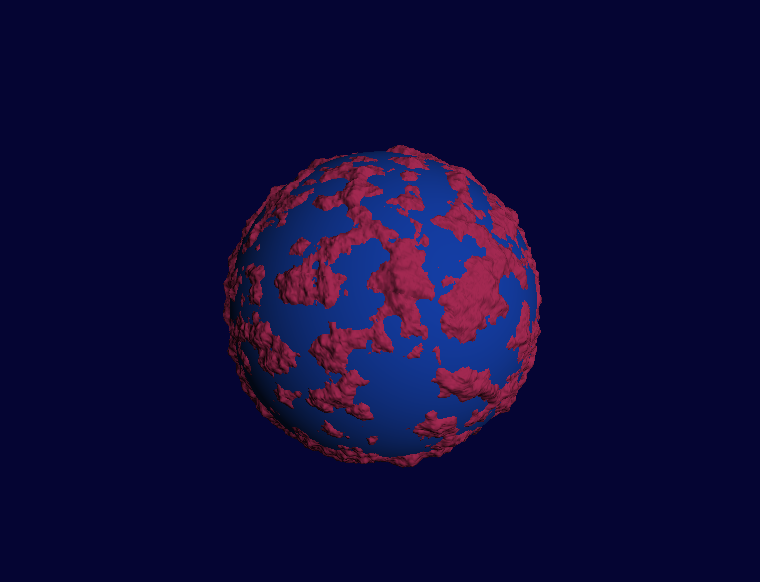

# Procedural Planets

Final project in TDT4230 Graphics and visualization. Procedurally generated planets with varying noise and colours. Focus has been on applying Level of Detail techniques, like scaling, moving coordinate system, and generating terrain with higher resolution depending on distance to planet. Detail level allows flying around in a solar system, as well as landing on and exploring the vast emptiness of each planet.

### Running

The project is written in [Rust](https://rust-lang.org) and requires Cargo. Run with `cargo run`

### Controls

* **`W A S D`**, **`shift`**, **`space`**: Movement
* **`Up`**, **`Down`**: Increase or decrease movement speed
* **`F`**: Toggle free float or anchor to center of gravity of closest planet
* **`I`**: Toggle GUI
* **`M`**: Cycle polygon modes (fill, lines, points)

## State of the project

## Behind the scene

The cubesphere. Not perfect, but well suited for my usecase.

Adding noise to the sphere makes the foundation for a planet.

An extra, low-poly sphere does the job as an ocean.

Adding height dependent colour scheme.

The varying detail level is shown clearly in wireframe mode.
