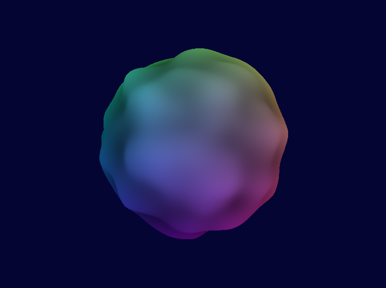
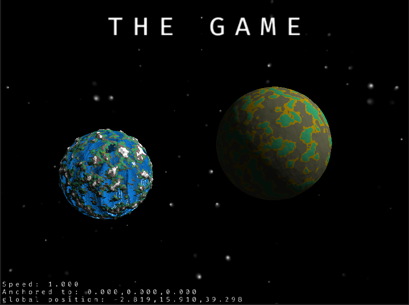
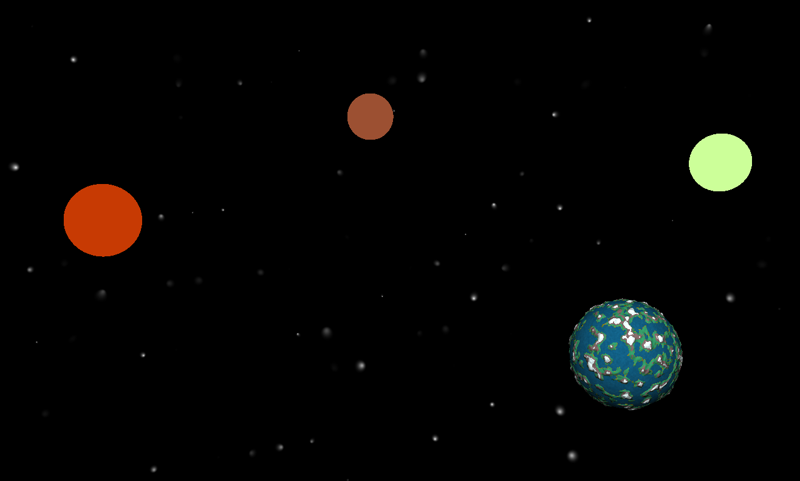

# README

## State of the project

## Controls

* **W A S D**, **shift space**: Movement
* **Up Down**: Increase or decrease movement speed
* **F**: Toggle free float or anchor to center of gravity of closest planet
* **I**: Toggle GUI
* **M**: Cycle polygon modes (fill, lines, points)

## Project description: Procedurally generated planet

For the final project I would like to make an attempt at creating a procedurally generated planet. I want to be able to render it from far away and have it become more detailed as the player closes in, which means having to apply some LoD techniques, e.g. partition the planet into chunks, resampling in higher resolution as a chunk comes closer, or adapting vertex count to local shape complexity. If this turns out too easy, I'd like to add more planets and place them in some solar system.

I wanted to explore cube marching, but not knowing whether it would be suitable for this task, I will look into it as well as optional methods for generating a terrain on a sphere, like noise textures or tessellation, or signed distance functions. Marching cubes is probably the best suited for allowing caves. If there's more time, I'd like to try adding bounding boxes so a player controlled camera can land on the planet.

Some of these ideas have been thoroughly explored by YouTube content creator Sebastian Lague, but he uses a full-fledged game engine and a different language, giving him things like bounding boxes for free. I hope to make use of Lague's videos as resources to save research time and spend more time implementing fun stuff.

I have a few spaceship 3D models from the last time I took the effort to try learning some modelling in Blender. It would be fun to add one of them to the scene, like a third person player-controlled ship or a star destroyer hovering over the atmosphere of the planet.

This brainstorming has left me with more ideas than I believe I'll be able to implement, but I really have no clue how difficult some of these things will be. So here's a somewhat prioritized checklist of subgoals. A realistic aim given the current workload in other courses and activities is probably just to reach the main goal.

- [ ] Main goal: Procedurally generate a planet with a satisfying level of detail on its terrain, with a corresponding texture and light from a sunlight source, and have a controllable camera to fly around and explore it.
- [ ] Allow the planet to have an ocean. Additional sphere with lower poly count.
- [ ] Generate several planets and place them in a solar system.
- [ ] Detect collision with the ground, so the player can land.
- [ ] Adding an atmosphere that modifies the sunlight.
- [ ] Loading some spaceship meshes to populate the vast space.
- [ ] Add particles, allowing the planet(s) to grow some trees, have some stones, or some active volcanos.

Keywords:
* Level of Detail techniques
* Types of sphere: UV, normalized, spherified cube, spherified pyramid, fibonacci, icosphere
* Merging VAOs to save draw calls? Subdividing a cube potentially creates many meshes to draw
* Terrain: Cube marching, or noise texture mapped to sphere
    * Noise texture applied to vertices. Try porting cubesphere generation and noise generation to compute shader
* Optionally extend to a little solar system, let planets have fixed orbits
* Collision detection to allow for a player to land on the planet (use `length(player_pos - planet_pos) > length(noise(vertex))`)
* Lighting: A sun, could try to add an atmosphere
* Particles: stones, trees
* Controller: A spaceship mesh
* Skybox: stars and ambient light. Implicit geometry: draw closest planet from vertex buffer, and draw all other objects on skybox from noise parameters and SDF.

Online resources

https://www.researchgate.net/publication/226410924_Spherical_Parameterization_of_Marching_Cubes_IsoSurfaces_Based_upon_Nearest_Neighbor_Coordinates

https://graphics.stanford.edu/~mdfisher/MarchingCubes.html

https://www.researchgate.net/publication/275971902_A_standardized_procedure_for_the_derivation_of_smooth_and_partially_overset_grids_on_the_sphere_associated_with_polyhedra_that_admit_regular_griddings_of_their_surfaces_Part_I_Mathematical_principles_

Multi-dimensional https://www.sciencedirect.com/science/article/pii/S002199911300538X

Icosphere: http://blog.andreaskahler.com/2009/06/creating-icosphere-mesh-in-code.html

Cubesphere, source for math: https://catlikecoding.com/unity/tutorials/cube-sphere/

Skybox: https://www.overdraw.xyz/blog/2018/7/17/using-cellular-noise-to-generate-procedural-stars

Ocean: https://www.shadertoy.com/view/Ms2SD1

Hash functions: https://www.shadertoy.com/view/4djSRW

## Timeline

* 13.3: Submit project description
* 18.3: Code and report deadline
* TBA: Presentations
