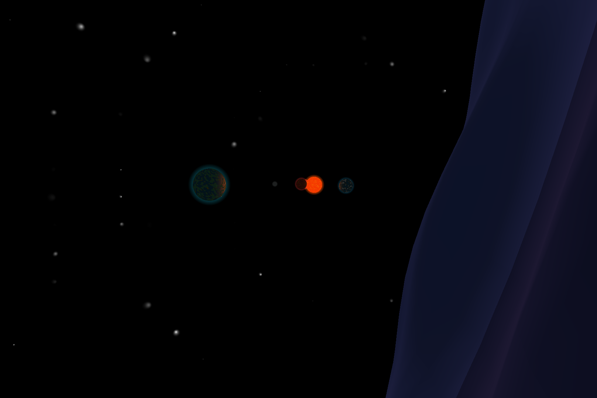
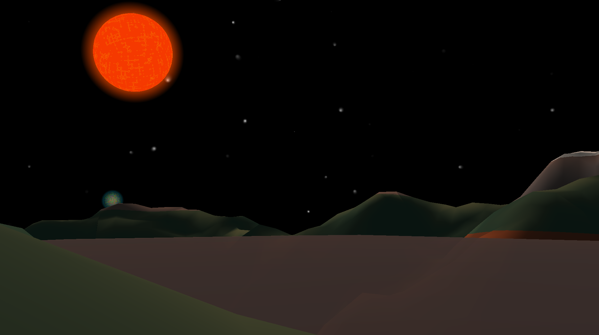
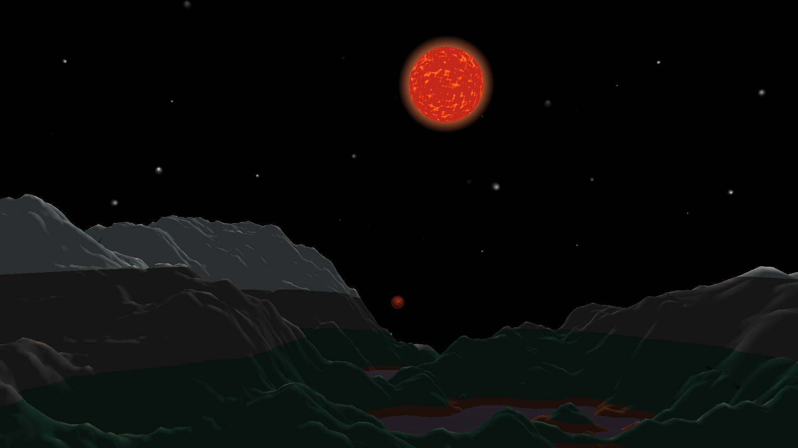
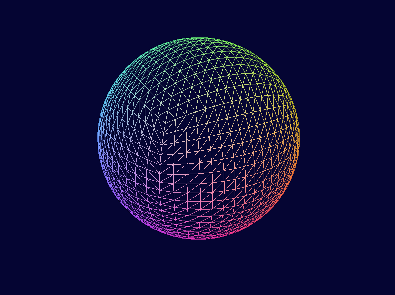

# Procedural Planets

Final project in TDT4230 Graphics and visualization. Procedurally generated planets with varying noise and colours. Focus has been on applying Level of Detail techniques, like scaling, moving coordinate system, and generating terrain with higher resolution depending on distance to planet. Detail level allows flying around in a solar system, as well as landing on and exploring the vast emptiness of each planet.

### Running

The project is written in [Rust](https://rust-lang.org) and requires Cargo. Run with `cargo run`.

Some configurations can be adjusted without recompiling in the `settings.conf` file. The scene is constructed in `scene.rs`, and planets parameters can be configured there.

### Controls

* **`W A S D`**, **`shift`**, **`space`**: Movement
* **`Up`**, **`Down`**: Increase or decrease movement speed
* **`F`**: Toggle free float or anchor to center of gravity of closest planet
* **`I`**: Toggle GUI
* **`M`**: Cycle polygon modes (fill, lines, points)

## State of the project

## Behind the scene

The cubesphere. Not perfect, but well suited for my usecase.

Adding noise to the sphere makes the foundation for a planet.

An extra, low-poly sphere does the job as an ocean.

Adding height dependent colour scheme.

The varying detail level is shown clearly in wireframe mode.

## Things to add

* [Bug] Fix the shadowing. Haven't got shadow from area lightsource to work.
* [Bug] In anchored and landed state, adjust camera direction as well when moving along the curve of the planet.
* [Bug] Continue work on precision, still some bugs when walking on a planet.
* Improve ocean shader. Currently just a blend of dark and light colour on a smooth sphere. 
    * Should deform normals and get some better light reflections in waves.
    * Reflect land masses in the ocean.
* Improve atmosphere, the current solution is quite naive and introduces a few problems with lighting. 
    * Figure out how to blend atmosphere with planets showing behind.
    * Light refraction when landed to make daylight and coloured sunset and sunrise.
    * There is a thing called post-processing shaders, that might solve this as well as the oceans.
    * [Nvidia GPU gems: atmospheric scattering](https://developer.nvidia.com/gpugems/gpugems2/part-ii-shading-lighting-and-shadows/chapter-16-accurate-atmospheric-scattering)
    * Rayleigh scattering
    * [Lague](https://www.youtube.com/watch?v=DxfEbulyFcY)
* Clouds, Mie scattering
* Improve skybox shader. Adding some colours to the stars would help a lot.
* Pass planet properties through SSBO (shader storage buffer object) instead of uniforms, allowing an infinite amount of planets.
* Add controllable spaceship and maybe a player mesh.
    * Add a spaceship mesh in the viewport when flying around. I have meshes that might work.
    * Make it possible to land the spaceship and walk away from it (reworking the Anchored → Landed state).
* Add planet rotation. Started, but discontinued for the project deadline.
* Add texturing and materials, currently the plain coloured terrain is very boring. Define a set of selectable material properties and implement in shader.
    * Define and implement some different materials: Sand, snow, gravel, grass, bedrock, dirt. Generate texture/normal map for each kind from noise, saving texture buffer and its mipmaps.
    * Add a tessalation shader to apply transforms. Normal maps generated from noise.
* Improve terrain generation. Currently just simple fractal noise on Perlin.
    * Define occurence of land masses, continents, smaller islands.
    * Structures: mountains, flatlands, craters, volcanos, ridges, etc. Noise function to define occurence of these.
        * Blend structures when they overlap.
* More models, add static buildings and constructions on planets, static or moving NPC vehicles, satellites, spacecrafts, land vehicles.
* More advanced planet trajectories, usually they are ellipses and not perfect circles.
    * Even more, entities in real world can revolve around each other in a pair.
    * Could consider implementing some simplified gravitational physics instead of just deciding the trajectory paths.
* GUI improvements
    * Add a loading screen (Not that loading takes any long atm), a start screen, and some nice menu/settings screen
    * Consider adding a crosshair to emphasize moving direction
    * Give planets names and display it when pointing at them, also show distance to the planet.
    * Improve the GUI layout (although it's mostly for debugging), maybe create a new layout for normal playing, not displaying information just needed for debugging.
* Extract general elements to an improved project baseline.
    * mesh module
* Mesh: merge meshes
* Do scene graph elements as a trait instead of a single struct